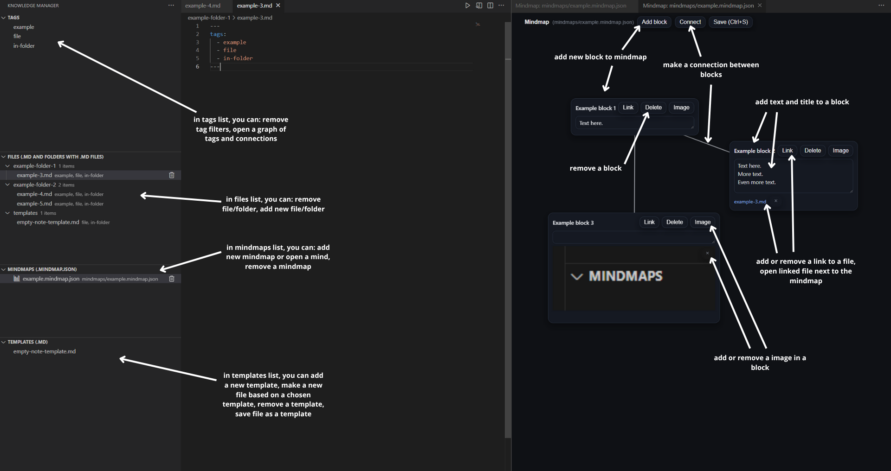
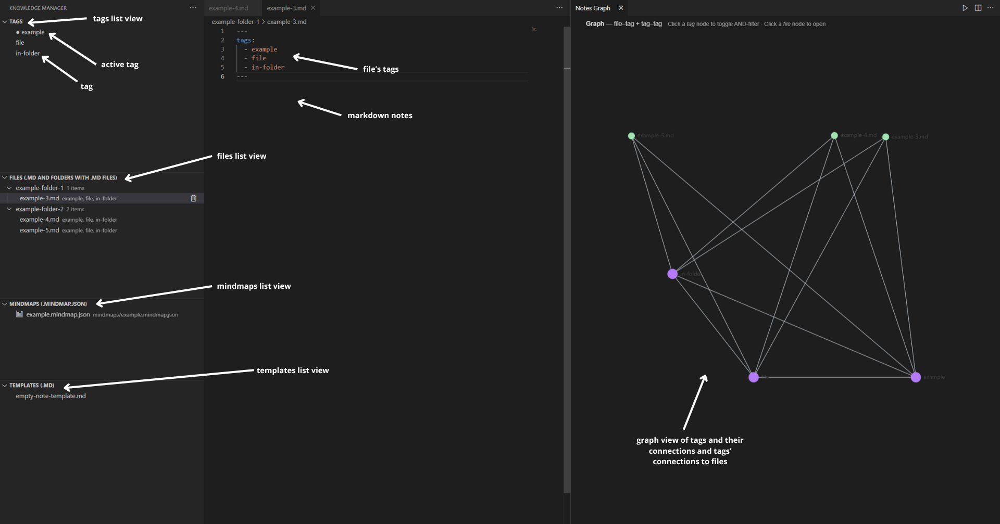

# Knowledge Manager Extension

A VS Code extension for **local knowledge management** — create and organize Markdown notes, tag them by topic, explore tag networks as graphs, and visualize ideas as mindmaps.

## Features

- 📝 **Markdown Notes** — Create, edit, and save notes directly in VS Code. Each note supports tags and frontmatter.
- 🏷️ **Tag Filtering** — Filter notes, mindmaps, and files by one or multiple tags.  
- 🧠 **Mindmaps** — Build visual mindmaps with draggable blocks that can contain text, images, and links to files. Automatically adapts to **light and dark themes**.  
- 🔗 **Graph View** — Automatically generated visualization of tag co-occurrences and relationships, also theme-adaptive.  
- 🧩 **Templates** — Create reusable note templates and generate new files based on them.  
- 📁 **Folders & Files** — Supports hierarchical folder structures and standard Markdown workflows.  
- 💾 **Local-first** — Works fully offline; files are stored locally in your workspace.  
- 🧭 **GitHub-friendly** — Files and images can be versioned via GitHub, though the extension itself does not perform Git operations.  
- ⚡ **Ctrl + S saves** your work instantly.

## Requirements

- No external dependencies.  
- The extension works with any standard VS Code installation.  
- Optionally, users can link their workspace to a GitHub repository for version control.

## Extension Settings

This extension currently contributes the following settings:

- `km.defaultNotesDir`: Defines which folder to use for notes.  
  - **Empty** = whole workspace.  
  - Otherwise, provide a relative path (e.g. `"notes/"`).  
- `km.graph.maxNodes`: Maximum number of nodes rendered in the graph view (default: `500`).  
- `km.mindmap.autosave`: Enables automatic saving of mindmaps when editing (default: `false`).  
- `km.twoPane`: Enables two-pane view for note editing and preview (default: `true`).  
- `km.templates.workspaceFolder`: Relative path for workspace templates (default: `"templates"`).

## Known Issues

- Graph is in MVP stage, so it doesn't highlight active tags from other connected tags.
- Currently in mindmap, user can't resize images in blocks.
- Lists might require manual refresh, but there are buttons in each list for it.

### Reporting Issues

If you encounter bugs, UI problems, or unexpected behavior, please report them by opening a new issue on GitHub:  
👉 [https://github.com/ronjahoo/knowledge-manager-extension/issues](https://github.com/ronjahoo/knowledge-manager-extension/issues)

When reporting:

- Describe what you were doing when the issue occurred  
- Include steps to reproduce it  
- Add screenshots if relevant  
- Mention your OS and VS Code version

## Release Notes

### 1.0.0

Initial MVP release — notes, tags, templates, mindmaps, and graph view integrated.

## Concept

> _"A local knowledge-management ecosystem that integrates notes, tags, mindmaps, and visual overviews — all within VS Code."_

Data types supported:

- **Folder** — hierarchical workspace structure  
- **File (.md)** — can contain tags, images, and frontmatter metadata  
- **Mindmap** — freeform visual workspace with blocks  
- **Block** — markdown text or image unit within a mindmap  
- **Tag** — labels shared across notes, mindmaps, and blocks  
- **Graph** — auto-generated network of tag relationships  

Use cases:

- Fully **local** (no cloud dependencies)  
- **Git-compatible** for manual version control  
- **Obsidian/Milanote/Scrintal-like** workflow for researchers, writers, and thinkers  

Enjoy organized thinking ✨

## Acknowledgements

Parts of this project’s documentation and code were created with assistance from AI tools (e.g. GitHub Copilot and OpenAI ChatGPT).  
All content was reviewed, tested, and curated by the author.
